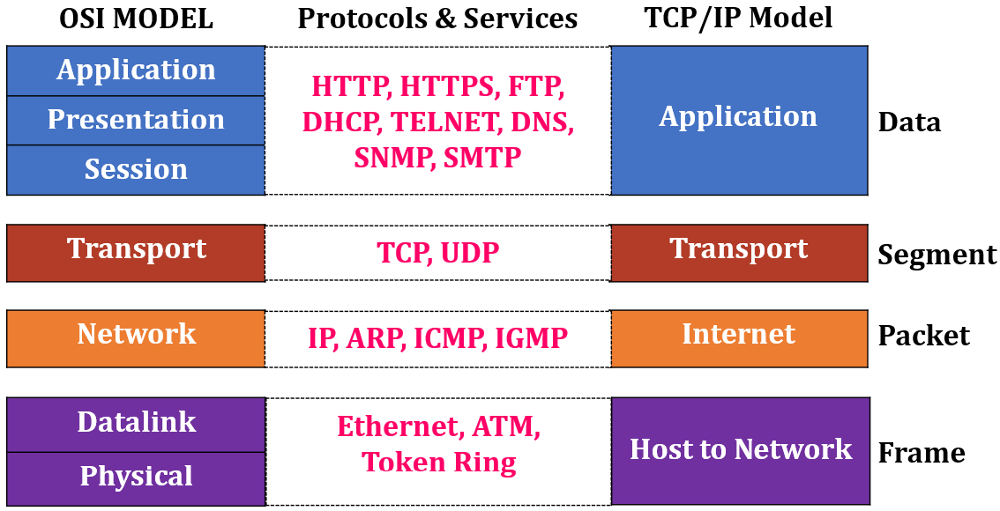
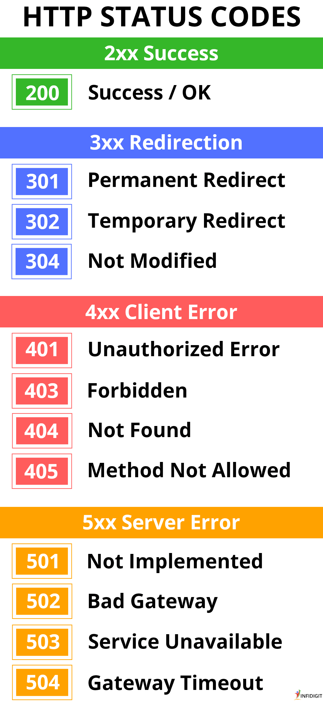
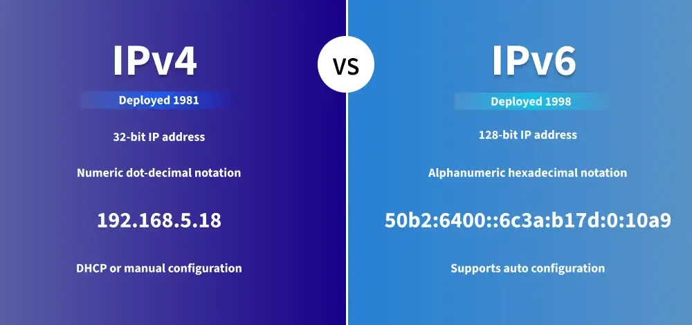
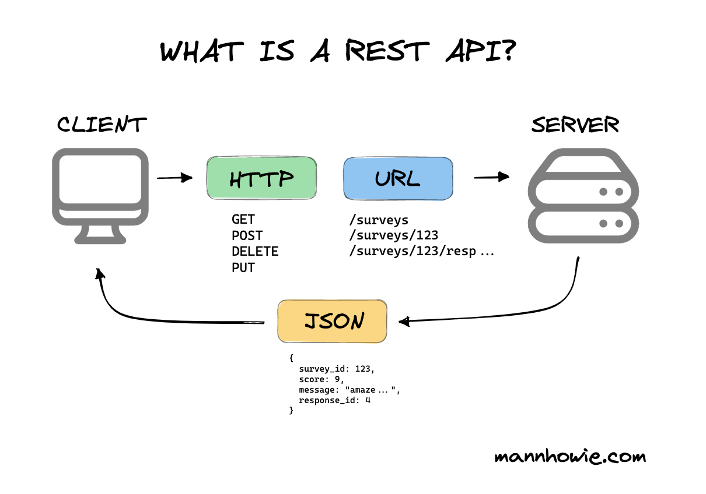

# Intro To NodeJS: Session 4

## Table of Contents

1. [Networks](#What-is-a-Network-?)
2. [HTTP Protocol](#HTTP-Protocol)  
2. [IP Address](#IP-Address)  
3. [DNS (Domain Name System)](#DNS-Domain-Name-System)  
4. [APIs (Application Programming Interfaces)](#APIs-Application-Programming-Interfaces)
5. [Express NodeJS - First API call](#Express-NodeJS---First-API-call)
6. [API Testing](#API-Testing)
6. [References](#References)

---

## What is a Network ? 
A network consists of **two or more computers that are linked** in order to share resources (such as printers and CDs), exchange files, or allow electronic communications. The computers on a network may be linked through cables, telephone lines, radio waves, satellites, or infrared light beams.

---

## Common Types of Networks: 
  -  Local Area Network (LAN)
  -  Wid Area Network (WAN)

---

## Network Layers 
  - **OSI Model**
      
  - **TCP/IP Model**
      


## HTTP Protocol
Explain the backbone of communication between clients and servers:

1. **What is HTTP ?**
    - Hypertext Transfer Protocol: A stateless, application-layer protocol used for transferring data over the web.
2. **HTTP Methods**
    - `GET` 
    - `POST`
    - `PUT`
    - `DELETE`
    - `PATCH`
2. **HTTP Request/Response cycle.**
    - **Request:** URL, Method, Headers, and Body.
        
    - **Response:** Status codes (e.g., 200 OK, 404 Not Found, 500 Internal Server Error), Headers, Body.
        
        
3. **HTTP Headers**
    - Common headers: Content-Type, Authorization, Cache-Control, etc.
    
4. **HTTP VS HTTPS:**
    - Secure communication with SSL/TLS.
4. **Cookies and Sessions**
    - State management and authentication.

--- 

## IP Address:

1. **What is an IP Address ?**

    An IP address (Internet Protocol address) is a unique identifier assigned to devices on a network (like computers, phones, servers). It helps devices locate and communicate with each other over the internet or a private network.


2. **IPv4 VS IPv6:**

    - **IPv4 (Internet Protocol Version 4):**
      - **Format:** IPv4 addresses are written in **dot-decimal notation**, consisting of **four numbers separated by dots**. Each number is between `0` and `255`.
      - **Example:** `192.168.1.1`
      - **Bit Size:** `32-bit` address (2³² possible addresses, about 4.3 billion unique IPs).
      - **Usage:** Most common type of IP address, used since the early days of the internet.
      - **Limitation:** With the explosion of internet-connected devices, **IPv4 addresses are running out**, leading to the adoption of `IPv6`.
    - **IPv6 (Internet Protocol Version 6):**
      - Format: IPv6 addresses are written in **colon-separated hexadecimal notation**, consisting of **eight groups** of **four hexadecimal digits**.
        - Example: `2001:0db8:85a3:0000:0000:8a2e:0370:7334`
        - Groups of zeroes can be shortened with `::` (e.g., `2001:db8::8a2e:370:7334`).
      - **Bit Size:** `128-bit` address (2¹²⁸ possible addresses, about 340 undecillion unique IPs).
      - **Usage:** Designed to **replace IPv4 and accommodate the growing number of devices.** It also improves security and efficiency.

| Tables   |      Are      |  Cool |
|----------| ------------- |------|
| Address Size | 32-bit (4.3 billion IPs) | 	128-bit (340 undecillion IPs) |
| Format | Decimal (e.g., 192.168.1.1)  | Hexadecimal (e.g., 2001:db8::1)|
| Security | No built-in encryption	 | Built-in IPSec for security |
| Efficiency | Simple, but limited	| Optimized for modern networks |
| Address Length	| Shorter | Longer |



## DNS (Domain Name System)
Cover how DNS plays a role in resolving web addresses:

1. **What is DNS?**
    - Converts human-readable domain names (e.g., example.com) into IP addresses.
2. **DNS Components:**
    - Domain Name, IP Address, Nameservers.
3. **DNS Lookup Process:**
    - Recursive Resolver → Root Server → TLD Server → Authoritative Name Server.
4. **Caching:**
    - Role of DNS caching in speeding up requests.
5. **DNS Records:**
    - `A`
      - Purpose: Maps a domain name.
      - Example:
        `example.com   A   192.168.1.1`

      - Usage: Directs traffic to a server's IPv4 address.
    - `AAAA`
      - Purpose: Maps a domain name to an IPv6 address.
      - Example:
        `example.com   AAAA   2001:0db8:85a3::8a2e:0370:7334`

      - Usage: Directs traffic to a server's IPv6 address.
    - `CNAME`
      - Purpose: Aliases one domain name to another.
      - Example:
        `www.example.com   CNAME   example.com`

      - Usage: Allows `www.example.com` to point to `example.com` without duplicating A or AAAA records.
    - `MX`
      - Purpose: Specifies the mail servers responsible for receiving emails for a domain.
      - Example:
        `example.com   MX   10 mail.example.com`
        - Priority: Lower numbers have higher priority (e.g., `10` is higher priority than `20`).
      - Usage: Routes emails to the correct mail server.
    - `TXT`
    - `NS`
    - `SOA`
    - `PTR`
    - `SRV`
    - `ALIAS or ANAME Record`
6. **Common DNS Issues:**
    - DNS propagation delays, misconfigurations.


---

## APIs (Application Programming Interfaces)

Discuss how backend systems communicate using APIs:

1. What is an API?
    - Interface for communication between software components.
1. Types of APIs:
    - `REST` (most common) 
    - `GraphQL`
    - `SOAP`
    - `gRPC.`
1. **RESTful APIs:**
    - **Principles:** 
      - **Stateless:** means that **calls can be made independently of one anther**
      - **CRUD Operations:** Create, Read, Update, Delete.
      - Via **HTTP protocol**
    - `JSON` and `XML` formats.
    
1. **Authentication in APIs:**
    - `API keys`, `OAuth2`, `JWT`.
1. **API Documentation:**
    - Importance of clear docs and tools like `Swagger`, `Postman`,`Thunder clint` .

---

## Express NodeJS - First API call

To establish a server using **Node.js**, you can use either the built-in http module or Express.js (which simplifies the process). Below are two methods:

  - Method 1 (Using Node.JS direct): 
  ``` js
    const http = require('http');

    // Create a server
    const server = http.createServer();

    // Listen on a port
    const PORT = 3000;
    server.listen(PORT, () => {
        console.log(`Server running on http://localhost:${PORT}`);
    });
  ```
  - Method 2 (Using Express Node.JS)
  ```js
    const express = require('express');
    const app = express();

    // Listen on a port
    const PORT = 3000;
    app.listen(PORT, () => {
        console.log(`Server running on http://localhost:${PORT}`);
    });
  ```
---

## API Testing:
  - Postman [Website](https://www.postman.com/) - [Extension](https://marketplace.visualstudio.com/items?itemName=Postman.postman-for-vscode)
  - Thunder Clint [Website](https://www.thunderclient.com/) - [Extension](https://marketplace.visualstudio.com/items?itemName=rangav.vscode-thunder-client)

## Task
1. Make sure to understand all the previous sessions. 
1. Publish a server using Node.Js direct.
1. Publish a server using Express.Node.Js. 
1. Access the server though your phone. 
1. Only run [meefr-quiz-game](https://www.npmjs.com/package/meefr-quiz-game) test - follow the steps mentioned in readme file.

## Task submission:

on github tasks repo.

---

## References

### Specific Refs:
- [Networks](https://www.geeksforgeeks.org/what-is-computer-networking/)
- [HTTP Protocol](https://developer.mozilla.org/en-US/docs/Web/HTTP/Overview)  
- [IP Address](https://www.geeksforgeeks.org/what-is-an-ip-address/) 
- [DNS Works](https://praveendandu24.medium.com/a-beginners-guide-to-how-dns-works-making-sense-of-the-internet-s-phonebook-cd90e2054f85)
- [RestAPI](https://www.geeksforgeeks.org/rest-api-introduction/)
- [Node.JS Docs](https://nodejs.org/docs/latest/api/)
### Optional Refs:
- [JS Behind the scene]()